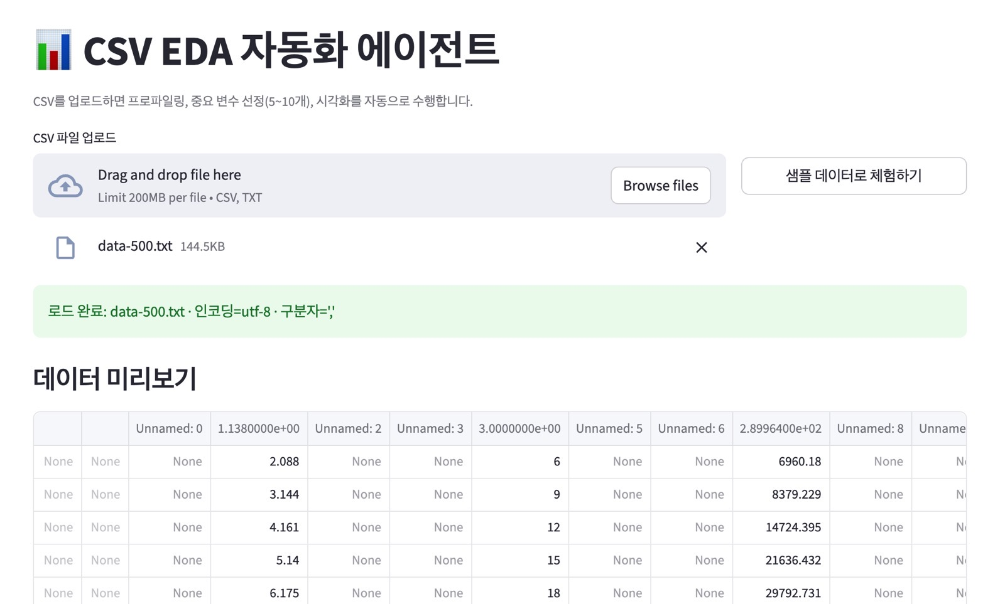

# CSV EDA 자동화 에이전트



CSV 파일을 업로드하면 자동으로 데이터 프로파일링 → 타겟 컬럼 추정 → 중요 변수 5~10개 랭킹 →
시각화를 수행하고, 분석을 재현하는 실행된 Jupyter Notebook을 다운로드할 수 있는 Streamlit 앱.

## 실행 방법

```bash
python3 -m venv .venv
source .venv/bin/activate
pip install -r requirements.txt
python -m ipykernel install --user --name python3 --display-name "Python 3"  # 노트북 다운로드 기능에 필요
streamlit run app.py
```

브라우저에서 CSV를 업로드하거나 "샘플 데이터로 체험하기"(`sample_data/sample_dataset.csv`,
직원 연봉 예측용 합성 데이터)를 눌러보세요.

## 구조

- `app.py` — Streamlit 엔트리포인트
- `eda/loading.py` — 인코딩/구분자 자동감지 CSV 로더
- `eda/profiling.py` — 결측치/중복/기술통계 프로파일링
- `eda/target.py` — 타겟 컬럼 자동 추정 + 회귀/분류 과제유형 판별
- `eda/importance.py` — RandomForest+상호정보량+상관계수 기반 지도 중요도 / PCA 기반 비지도 중요도
- `eda/visualize.py` — 분포·타겟 관계·상관관계·중요도 차트
- `eda/notebook_builder.py` — 분석을 재현하는 `.ipynb`를 생성·실행(nbclient)하여 bytes로 반환
- `sample_data/generate_sample.py` — 데모용 합성 데이터셋 생성 스크립트

## 참고

- 타겟은 컬럼명 패턴으로 자동 추정되며, 항상 화면에서 수동으로 변경할 수 있습니다.
- 타겟을 "타겟 없음"으로 두면 PCA 기반 비지도 중요도(정보량이 큰 변수) 방식으로 전환됩니다.
- 다운로드되는 노트북은 원본 CSV를 base64로 내장하고 있어 원본 파일 없이도 독립적으로 재실행됩니다.

## 작업 이력

### v0.1 — 초기 구현
- Streamlit 앱 구조 설계: 업로드 → 프로파일링 → 타겟 자동추정/override → 중요도 랭킹(5~10개) → 시각화 → Jupyter Notebook 다운로드
- `eda/` 패키지 분리: `loading`(인코딩·구분자 자동감지), `profiling`, `target`, `importance`(지도: RandomForest+상호정보량+상관계수 / 비지도: PCA 정보량), `visualize`, `notebook_builder`(nbclient로 실행된 `.ipynb` 생성)
- 체험용 합성 데이터셋(`sample_data/generate_sample.py`, 직원 연봉 예측 500행) 추가

### v0.2 — 실행 검증 중 발견한 버그 수정
실제로 앱을 구동하고 `streamlit.testing.v1.AppTest`로 업로드→분석→노트북 생성 전 과정을 실행해보는 과정에서 아래 결함들을 발견하여 수정했습니다.

1. **타겟 자동추정 오탐지** — 힌트 단어 `"y"`가 부분일치(substring)로 매칭되어 `employee_id`처럼 철자에 `y`가 포함된 거의 모든 컬럼을 타겟으로 잘못 추정. 이 상태로 분류 중요도를 계산하면 사실상 행 개수만큼 클래스가 생겨 `mutual_info_classif`가 내부 오류(`Found array with 0 sample(s)`)로 죽는 2차 장애로 이어짐.
   - 수정: 힌트 매칭을 단어 경계(토큰) 기준으로 변경, ID처럼 보이는 고유값·고카디널리티 컬럼은 타겟 후보에서 원천 배제. 분류 타겟의 클래스 수가 비정상적으로 많으면(전체 행의 50% 초과 등) 명확한 에러 메시지로 안내하도록 방어 코드 추가.
2. **한글 차트 제목 깨짐** — matplotlib 기본 폰트(DejaVu Sans)에 한글 글리프가 없어 차트 제목·라벨의 한글이 렌더링되지 않고 경고와 함께 빈 박스로 표시됨.
   - 수정: 시스템에 설치된 한글 폰트(AppleGothic, Nanum Gothic 등)를 자동 감지해 적용. Streamlit 앱과 다운로드되는 노트북 양쪽에 동일하게 적용.
3. **Streamlit deprecated 파라미터** — `use_container_width=True`가 향후 제거 예정 경고를 발생시킴 → `width="stretch"`로 교체.

### 알려진 제한사항 (다음 개선 후보)
- 공백/고정폭으로 구분된 원본 텍스트(예: 과학적 표기법 숫자가 여러 칸 공백으로 나열된 데이터)를 업로드하면 구분자 자동감지가 공백을 컬럼 구분자로 오인해 컬럼이 밀리고 `Unnamed: N` / 빈 값이 다수 발생하는 현상이 있습니다. 현재는 콤마/세미콜론/탭 등 명시적 구분자가 있는 정형 CSV를 기준으로 검증되었으며, 공백 구분 텍스트 지원은 추후 개선 예정입니다.
